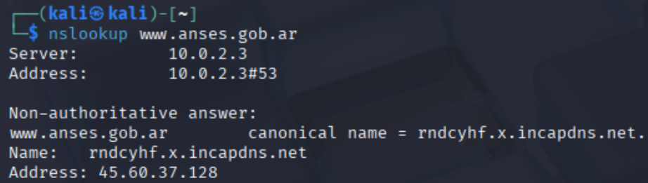
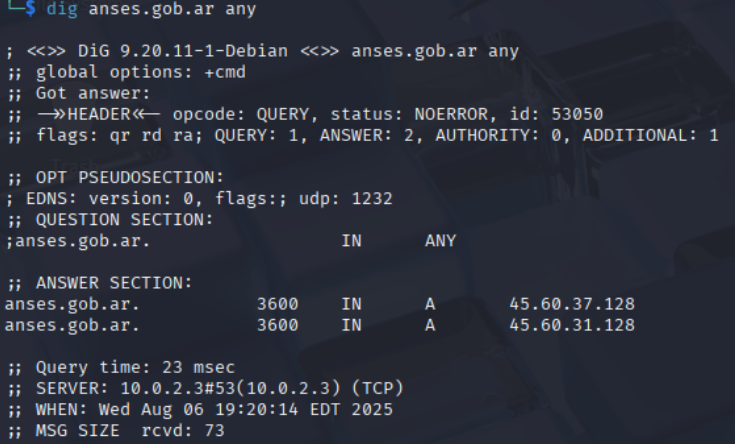
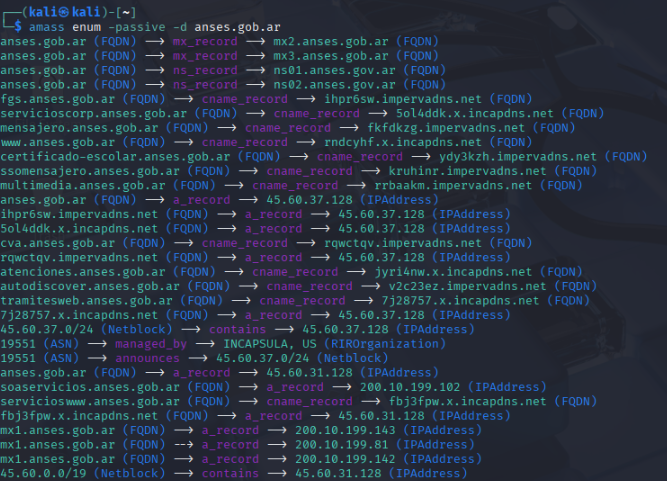
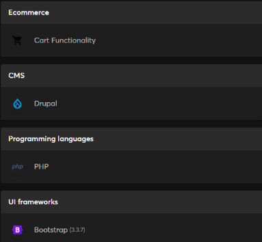
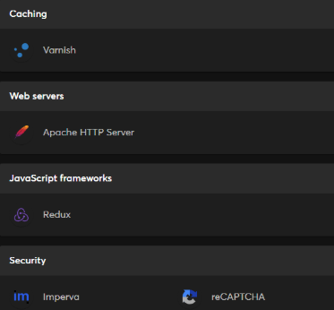

# ANSES Web Reconnaissance

## Objective

Conduct a web reconnaissance assessment of the ANSES website using publicly available information (OSINT) to identify technologies, infrastructure components and potential security considerations.

## Scope

Target:

* [www.anses.gob.ar](http://www.anses.gob.ar)

Assessment Type:

* Passive reconnaissance
* Public information gathering
* Attack surface analysis

## Tools Used

* nslookup
  
* dig
  
* amass
  
* dnsenum
* 
* WhatWeb
* Wappalyzer
  
  
* BuiltWith
* Browser Developer Tools
* Nmap
  

## Methodology

### DNS Analysis

The target domain was analyzed to identify DNS records, aliases and infrastructure providers.

### Subdomain Enumeration

Publicly accessible subdomains were identified using passive enumeration techniques.

### Technology Fingerprinting

Several tools were used to identify web technologies, frameworks, security controls and server-side components.

### Browser Analysis

Developer tools were used to inspect client-side resources and identify potential indicators of outdated components.

### Port Scanning

Publicly exposed services were evaluated to identify accessible ports and security controls.

## Key Findings

### Infrastructure Protection

* Reverse proxy and security protection mechanisms were identified.
* HTTPS was enforced for secure communications.
* Security headers and cookie protection mechanisms were observed.

### DNS and Network Information

* Public DNS records and mail infrastructure were identified.
* Subdomains and network ranges associated with the organization were discovered through passive enumeration.

### Technology Stack

Technologies identified included web frameworks, JavaScript libraries and server-side components.

Several components appeared to have known historical vulnerabilities if not properly updated.

### Security Controls

The assessment identified the use of:

* HTTPS
* HttpOnly Cookies
* Cache Control Policies
* CAPTCHA Protection
* Reverse Proxy Security Services

## Security Considerations

Potential risks identified during the assessment included:

* Outdated web components
* Historical XSS vulnerabilities in third-party libraries
* Client-side resource loading issues
* Potential attack surface exposed through publicly available information

No evidence of exposed insecure services or sensitive information leakage was observed.

## Conclusion

The assessment indicates that the target employs multiple layers of security protection, including traffic filtering, encrypted communications and browser-side security controls.

While some technologies may require continuous patch management, no critical exposures were identified during this reconnaissance activity.

## Disclaimer

This project was conducted exclusively for educational purposes as part of an Ethical Hacking training program.

All information was obtained from publicly available sources. No exploitation, unauthorized access or modification of target systems was performed.

